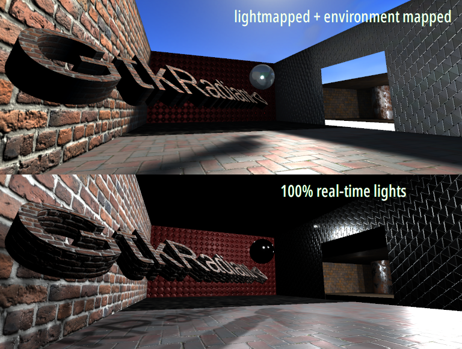

# Nuclide SDK PBR Example



This repository contains 3 GLSL files meant for use in FTEQW, which will enable [Physically Based Rendering]([https://en.wikipedia.org/wiki/Physically_based_rendering]).
Included are some test assets (from ambientcg.com) that are incorporated into a test-map.
The test-map is a modified idTech 3 BSP with cubemap surface info.

Both lightmapped and fully-realtime lighting paths are supported.

To get started, either start a new game or enter
`map test_pbr` in console.

If you don't see reflections showing up, make sure
gl_specular is set to something higher than 0, then
issue 'vid_reload' in console.

All the assets in here are licensed CC0/Public Domain.

# Installation
Clone into a set-up Nuclide SDK like so:

`git clone https://www.github.com/VeraVisions/nuclide-pbr base_pbr`

Run:

`./nuclide -game base_pbr +map test_pbr`

# Content Notes
For the PBR we're using 3 main asset samplers:

* Albedo
* Normal
* MRA (metalness, roughness, ambient occlusion)

An example of one of our material files:

```
// Vera Visions Material
{
	diffusemap textures/pbrtest/bricks045.tga
	normalmap textures/pbrtest/bricks045_local.tga
	specularmap textures/pbrtest/bricks045_mra.tga
	
	{
		program defaultwall
	}
}
```

Note the **specularmap** sample gets used to carry the MRA info.

If you're making your own map, you don't have to write a material (.mat) file for every
surface. In theory the engine will just assign the samples if you suffix them
clearly:

* Albedo: `textures/foo.tga`
* Normal: `textures/foo_norm.tga`
* MRA: `textures/foo_gloss.tga`

And everything should, in theory, just work.
Build cubemaps with the `buildcubemaps` dev command, make sure you place **env_cubemap**
entities around your level.

The `testLight` and `testPointLight` commands can be used to spawn real-time
lights into the level to test your environment.

To turn off the lightmap that's baked into the level, set **r_shadow_realtime_world_lightmaps** to **0**

# Why MRA?

It's the **same format as UE4** from our research, so tools like Substance Painter
and the like should easily export it. However, the three GLSL files should be
simple enough to edit should you consider adopting a different packing format
for the RGB channel data.

# Copyright
While the content in this repo (this means textures, map and model assets) licensed
under the CC0 license, the associated code is under the same license as the rest
of the Nuclide SDK.

Copyright (c) 2015-2021 Vera Visions LLC. All rights reserved.
